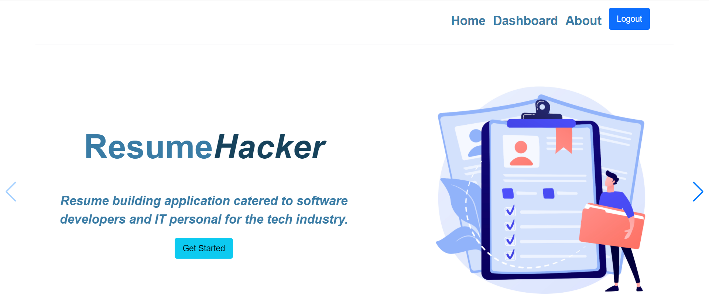
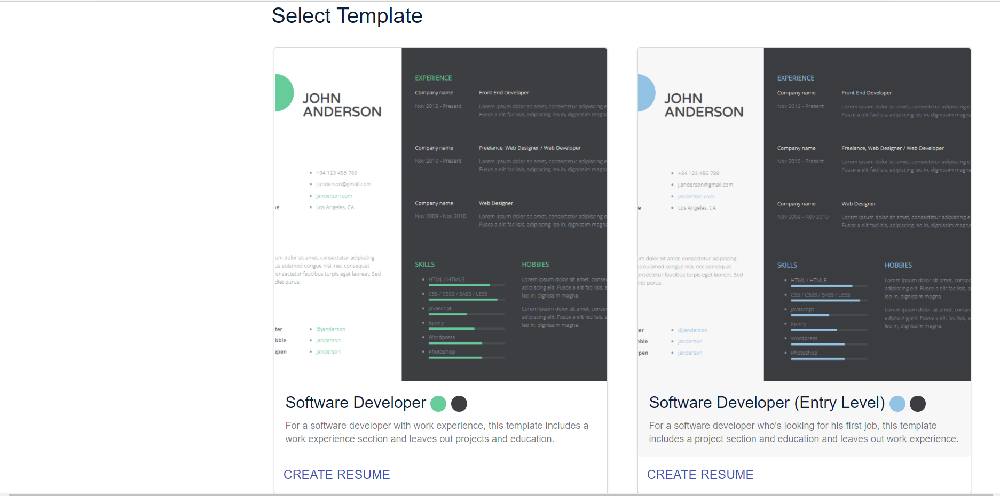
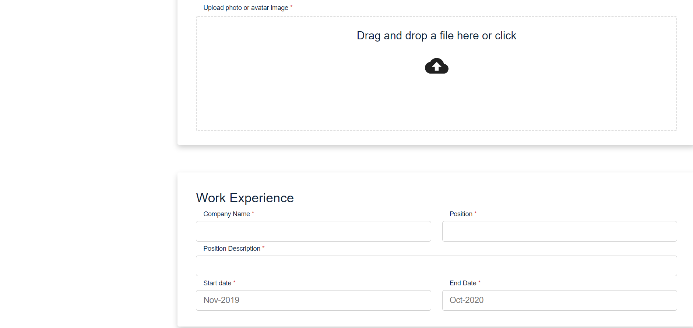
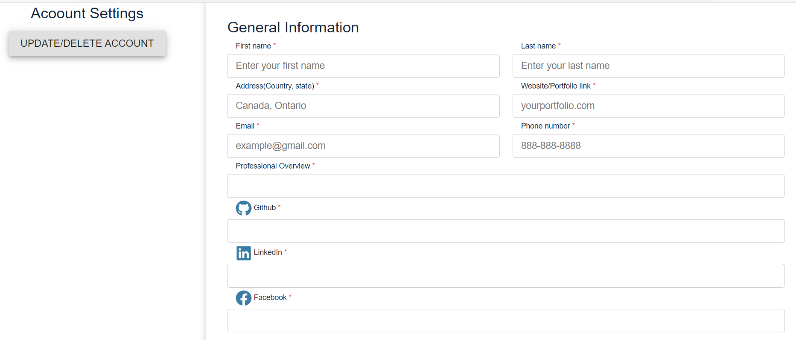

# ResumeHacker

## Description

Resume Hacker is an application that assists those who are interested in creating a personal resume. This application enables the user to create thier own personal resume by adding personal info. The user will have the ability to update and delete their accounts on this website. 

## Link to deployed application: 

## Motivation

The motivation behind this project is to assist the user in creating their personal resume.

## Technologies used:
* HTML5
* CSS
* Bootstrap
* React.js
* MongoDb
* Node.js
* Express
* Express-Sessions
* Mongoose
* Bcrypt
* GraphQl

## User Story

* AS someone looking for a job I want to create my personal resume. 

## Usage

The user can initially sign up for an account, and can login afterwards. Once the user is signed in, they can create their personal resume by answering multiple questions

## Contributors

Contributors to this project includes:
 Ernest Arutiunian, Ahmad Mujeeb, Jugraj Nijjar

## Contact Information
Ernest: 
- GitHub: https://github.com/ErnestAr
- Email: arutiunian.ernest@gamil.com

Ahmad: 
- GitHub: https://github.com/ahmadmujeeb33
- Email: ahmadmujeeb333@gmail.com

Jugraj:
- Github: https://github.com/jugrajn
- Email: jugraj.nijjar@gmail.com
 

